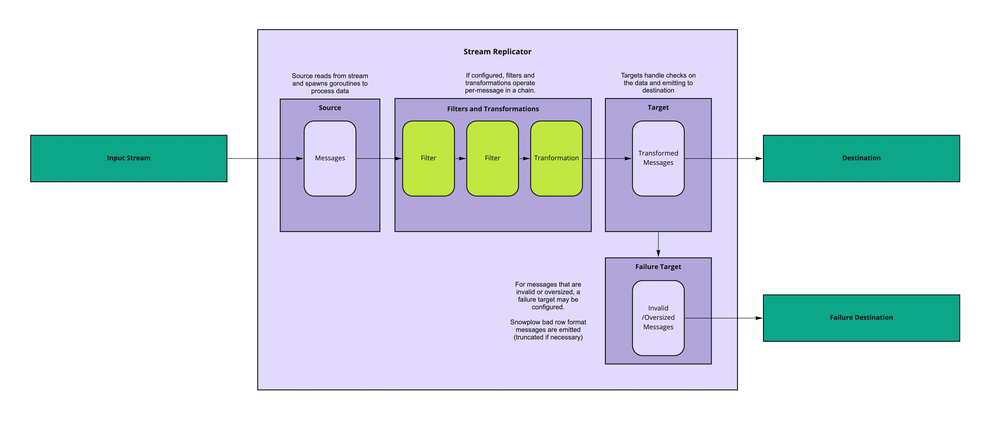

# Application Overview

## Architecture Overview

Stream Replicator's architecture is fairly simple - it receives data from one streaming technology (via Sources), optionally runs filtering and transformation logic on them (message-by-message, via Transfomations), and sends the data to another streaming technology or destination (via Targets). If it is not possible to process or retry the data [as per the failure model](./failure-model.md), it outputs a message to another destination (via Failure Targets).

## Operational details

Data is processed on an at-least-once basis, and there is no guarantee of order of messages. The application is designed to minimise duplicates as much as possible, but there isn't a guarantee of avoiding them - for example if there's a failure, it is possible for messages to be delivered without a successful response, and duplicates can occur. 

Stream Replicator is built to suit a horizontal scaling model, and internally handles multiple instances consuming the same input (the kinesis source requires Dynamo DB tables to be created for this purpose). Within each instance, concurrency may be managed via the `source_concurrent_writes` setting.