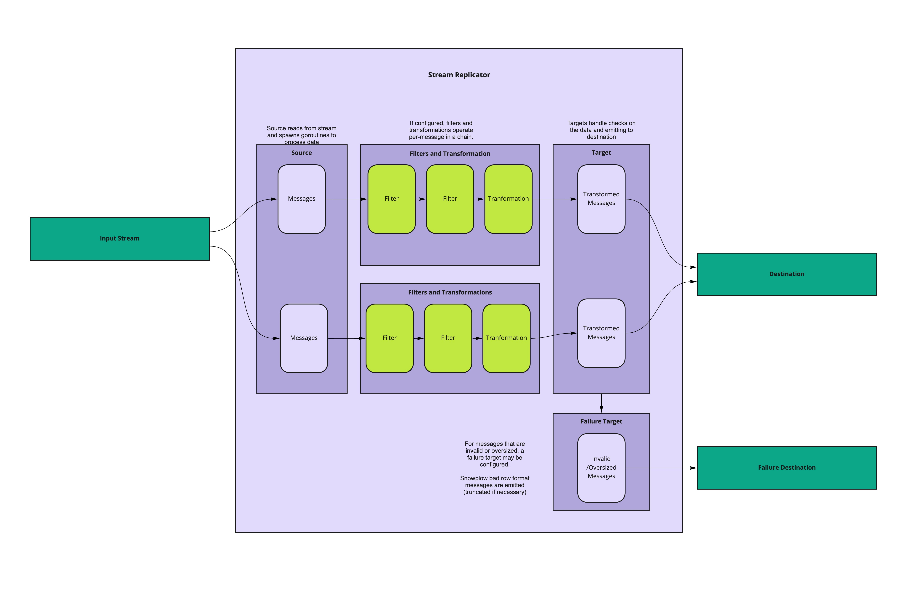

# Application Overview

## Architecture Overview

// TODO: Add section links

Stream replicator's architecture is fairly simple - it receives data from one streaming technology (via Sources), optionally runs filtering and transformation logic on them (message-by-message, via Transfomations), and sends the data to another streaming technology or destination (via Targets). If it is not possible to process or retry the data [for some reason](TODO: LINK TO FAILURE MODELS), it outputs a message to another destination (via Failure Targets).

// TODO: Get design team input on diagram

## Operational details

Data is processed on an at-least-once basis, and there is no guarantee of order of messages. The application is designed to minimise duplicates as much as possible, but there isn't a guarantee of avoiding them - for example where there's a failure scenario, it is possible for messages to be delivered without a successful response, and duplicates can occur. 

Stream replicator is built to suit a horizontal scaling model, and internally handles multiple instances consuming the same input (the kinesis source requires Dynamo DB tables to be created for this purpose). Within each instance, concurrency may be managed via the `source_concurrent_writes` setting.

## Concepts

### Batching model

Messages are processed in batches according to how the source provides data. The Kinesis and Pubsub sources provide data in single-events, so no batching is possible at present. The SQS source is batched according to how the SQS queue returns them.

Transformations always handle individual messages at a time.

If the source provides the data in batch, the Kinesis, SQS, EventHub and Kafka targets can chunk the data into smaller batches before sending the requests. The EventHub target can further batch the data according the the EventHub client's batching logic (by partition key). The Pubsub and HTTP targets handle events individually at present.

// TODO: Link to the weird jank event hub stuff

// Note: not a big fan of listing these things here because when we change these features we rely on remembering to update this - and I doubt we will. I would prefer to remove as much reliance on this kind of thing as possible.

### Sources

Sources are essentially plugins to deal with consuming the input stream, and spawning goroutines within which transformations and targets to operate. Concurrency is throttled at source, and is configurable.

// TODO: Note that this part is something that'll have to be manually updated when we get to changing the behaviour - is there a way to rely on something better than us remembering?
// - One option is to add a note to the issue - perhaps we can tag issues which require manual doc updates?

Currently, stream replicator does not manually batch data - if data is received from the source in batches, it forwards messages in those batches for processing. If the data is not batched on input (as is the case with the kinesis source), at present it will operate in single-event batches.

### Targets

Targets are plugins to deal with checks for validity and size restrictions, and sending data to the end destination. If data is provided in batches, and where the destination client suits batching, the user can configure the 'chunk' size of batches sent to the target (as distinct from the size of batches received at input).

### Failure model
#### Failure targets

When stream replicator hits an unrecoverable error - for example oversized or invalid data - it will emit information a [failed event](https://docs.snowplow.io/docs/managing-data-quality/failed-events/understanding-failed-events#what-is-a-failed-event) to the configured failure target. A failure target is the same as a target, the only difference is that the configured destination will receive failed events.

#### Failure cases

There are several different failures that Stream Replicator may hit:

**Target failure**

This is where a request to the destination technology fails or is rejected - for example a http 400 response is received. When stream replicator hits this failure, it will retry 5 times. If all 5 attempts fail, it will be reported as a 'MsgFailed' for monitoring purposes, and will proceed without acking those Messages. As long as the source's acking model allows for it, these will be re-processed through stream replicator again.

Note that this means failures on the receiving end (eg. if an endpoint is unavailable), then stream replicator will continue to attempt to process the data until the issue is fixed.

**Oversised data**

Targets have limits to the size of a single message or request. Where the destination technology has a hard limit, targets are hardcoded to that limit. Otherwise, this is a configurable option in the target configuration. When a message's data is above this limit, stream-replicator will produce a [size violation failed event](https://docs.snowplow.io/docs/managing-data-quality/failed-events/understanding-failed-events/#size-violation), and emit it to the failure target.

Writes of oversized messages to the failure target will be recorded with 'OversizedMsg' statistics in monitoring. Any failure to write to the failure target will cause stream replicator to crash.

**Invalid data**

In the unlikely event that stream replicator encounters data which is invalid for the target destination (for example empty data is invalid for pubsub), it will create a [generic error failed event](https://docs.snowplow.io/docs/managing-data-quality/failed-events/understanding-failed-events/#generic-error),  emit it to the failure target, and ack the original message.

Transformation failures are also treated as invalid, as described below.

Writes of invalid messages to the failure target will be recorded with 'InvalidMsg' statistics in monitoring. Any failure to write to the failure target will cause stream replicator to crash.

**Transformation failure**

Where a transformation hits an exception, stream replicator will consider it invalid, assuming that the configured transformation cannot process the data. It will create a [generic error failed event](https://docs.snowplow.io/docs/managing-data-quality/failed-events/understanding-failed-events/#generic-error), emit it to the failure target, and ack the original message.

As long as the built-in transformations are configured correctly, this should be unlikely. For scripting transformations, stream replicator assumes that an exception means the data cannot be processed - make sure to construct and test your scripts accordingly.

Writes of invalid messages to the failure target will be recorded with 'InvalidMsg' statistics in monitoring. Any failure to write to the failure target will cause stream replicator to crash.

### Transformations and filters

Transformations allow you to modify data on the fly before they're sent to the destination. There are a set of built-in transformations, specifically for use with [Snowplow](https://snowplow.io/) data (for example transforming Snowplow enriched events to JSON), You can also configure a script to transform your data however you require - for example if you need to rename fields or change a field's format.

It's also possible to exclude messages (ie. not send them to the target) based on a condition, by configuring a special type of transformation called a filter. (Technically then, filters are transformations, but we sometimes refer to them as a separate concept for clarity). Again there are built-in filters to apply to Snowplow data, or you can provide a script to do filter the data.

Transformations operate on a per-message basis, are chained together in the order configured, and the same type of transformation may be configured more than once. It is advisable to place filters first for performance reasons. When transformations are chained together, the output of the first is the input of the second, however transformations may not depend on each other in any other way. 

For example, if you have a built-in filter with condition A, and a filter with condition B, I may arrange them one after another, so that the data must satisfy A AND B. But you can't arrange them to satisfy A OR B - because the outcome of each must be determined on their own.

The latter use case, and further nuanced use cases can, however, be achieved using scripting transformation.

### Custom Scripting transformations

Custom scripting transformations allow the user to provide a script to transform the data, set the destination's partition key, or filter the data according to their own custom logic. Scripts may be provided in Lua or Javascript. For each script provided, a runtime engine is used to run the script against the data. Scipts interface with the rest of the app via the EngineProtocol interface, which provides a means to pass data into the scripting layer, and return data from the scripting layer back to the app.

For more detail on using custom scripts, see // TODO: WHERE DOES THE DETAIL GO?

