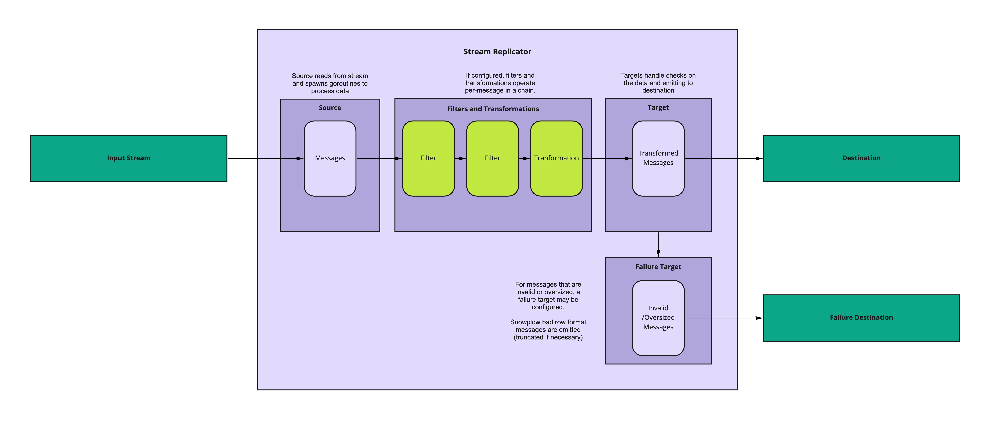

# Concepts

## Architecture Overview

Stream replicator's architecture is relatively simple - sources read from the input stream, and spawn goroutines for batches of data - within these goroutines, 0 or more transformations operate on the data (on a per-event basis, chained one after another). Targets are then called within the same goroutine, and are responsible for first checking that the data is under the configured size limit, and that it's valid data - then sending to the target. Oversized or invalid data is sent to a failure target in Snowplow bad row format.

// TODO: Feedback on & tidy up of arch diagram

## Concepts

### Sources

Sources are essentially plugins to deal with consuming the input stream, and spawning goroutines within which transformations and targets to operate. Concurrency is throttled at source, and is configurable.

// TODO: Note that this part is something that'll have to be manually updated when we get to changing the behaviour - is there a way to rely on something better than us remembering?
// - One option is to add a note to the issue - perhaps we can tag issues which require manual doc updates?

Currently, stream replicator does not manually batch data - if data is received from the source in batches, it forwards messages in those batches for processing. If the data is not batched on input (as is the case with the kinesis source), at present it will operate in single-event batches.

### Targets

Targets are plugins to deal with checks for validity and size restrictions, and sending data to the target. If data is provided in batches, and where the target client suits batching, the user can configure the 'chunk' size of batches sent to the target (as distinct from the size of batches received at input).

### Failure model
#### Failure targets

When stream replicator hits an unrecoverable error - for example oversized or invalid data - it will emit information a [failed event](https://docs.snowplow.io/docs/managing-data-quality/failed-events/understanding-failed-events#what-is-a-failed-event) to the configured failure target. A failure target is the same as a target, the only difference is that the configured destination will receive failed events.

#### Failure cases

There are several different failures that Stream Replicator may hit:

**Target failure**

This is where a request to the destination technology fails or is rejected - for example a http 400 response is received. When stream replicator hits this failure, it will retry 5 times. If all 5 attempts fail, it will be reported as a 'MsgFailed' for monitoring purposes, and will proceed without acking those Messages. As long as the source's acking model allows for it, these will be re-processed through stream replicator again.

Note that this means failures on the receiving end (eg. if an endpoint is unavailable), then stream replicator will continue to attempt to process the data until the issue is fixed.

**Oversised data**

Targets have limits to the size of a single message or request. Where the destination technology has a hard limit, targets are hardcoded to that limit. Otherwise, this is a configurable option in the target configuration. When a message's data is above this limit, stream-replicator will produce a [size violation failed event](https://docs.snowplow.io/docs/managing-data-quality/failed-events/understanding-failed-events/#size-violation), and emit it to the failure target.

Writes of oversized messages to the failure target will be recorded with 'OversizedMsg' statistics in monitoring. Any failure to write to the failure target will cause stream replicator to crash.

**Invalid data**

In the unlikely event that stream replicator encounters data which is invalid for the target destination (for example empty data is invalid for pubsub), it will create a [generic error failed event](https://docs.snowplow.io/docs/managing-data-quality/failed-events/understanding-failed-events/#generic-error),  emit it to the failure target, and ack the original message.

Transformation failures are also treated as invalid, as described below.

Writes of invalid messages to the failure target will be recorded with 'InvalidMsg' statistics in monitoring. Any failure to write to the failure target will cause stream replicator to crash.

**Transformation failure**

Where a transformation hits an exception, stream replicator will consider it invalid, assuming that the configured transformation cannot process the data. It will create a [generic error failed event](https://docs.snowplow.io/docs/managing-data-quality/failed-events/understanding-failed-events/#generic-error), emit it to the failure target, and ack the original message.

As long as the built-in transformations are configured correctly, this should be unlikely. For scripting transformations, stream replicator assumes that an exception means the data cannot be processed - make sure to construct and test your scripts accordingly.

Writes of invalid messages to the failure target will be recorded with 'InvalidMsg' statistics in monitoring. Any failure to write to the failure target will cause stream replicator to crash.

### Transformations and filters

Transformations are a process which can filter or transform the data in-flight. Filters are transformations which check for a filter condition - if the condition is satisfied, the filter will ack the message immediately and remove it from the queue for sending to the target. While we may sometimes refer to filters as a separate concept for more understandable documenation, within the codebase filters are conceptually a type of transformation.

Transformations operate on a per-event basis, and are chained together in the order in which they're configured. It is generally advisable to place filters first where possible, for the most efficient configuration.

The same type of transformation may be configured more than once - for example you may want to configure two filters to satisfy two different conditions.

Transformations do not have an awareness of each others' state - so a filter cannot depend on the outcome of another filter, for example. Each transformation is a self-contained piece of logic which must determine its own outcome. More complex transformation and filtering logic may be instrumented via the custom Lua and JS scripting transformations. See the scripting transformation interface section for more detail. 

// TODO: organisation of information - where's the best place to go detailed on scripting, and how should it be referred to here?

### Custom Scripting transformations

Custom scripting transformations allow the user to provide a script to transform the data, set the partition key, or filter the data according to their own custom logic. Scripts may be provided in Lua or Javascript. For each script provided, a runtime engine is used to run the script against the data. Scipts interface with the rest of the app via the EngineProtocol interface, which provides a means to pass data into the scripting layer, and return data from the scripting layer back to the app.

For more detail on using custom scripts, see // TODO: WHERE DOES THE DETAIL GO?

